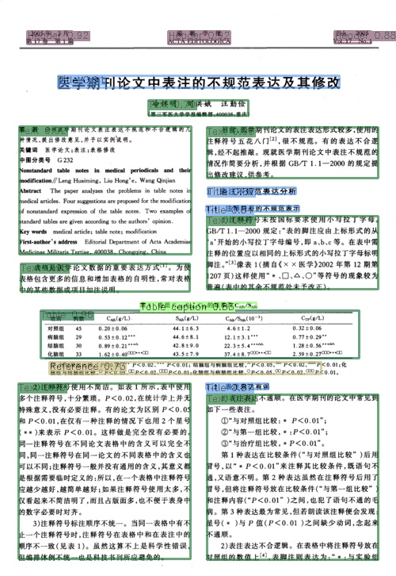

### c++ yolov8实现版面检测
利用c++加载yolov8模型，进行推理。

yolov8-c++ is used to detect the layout of Chinese document images

#### 数据
本项目根据开源中文版面数据[CDLA](https://github.com/buptlihang/CDLA)  ，利用yolov8进行训练

CDLA是一个中文文档版面分析数据集，面向中文文献类（论文）场景。包含以下10个label：

|正文|标题|图片|图片标题|表格|表格标题|页眉|页脚|注释|公式|
|---|---|---|---|---|---|---|---|---|---|
|Text|Title|Figure|Figure caption|Table|Table caption|Header|Footer|Reference|Equation|


推理：src/main/main.cpp
```
int main() {
    const string modelPath = "E:\\clion_project\\layout_onnx_cplusplus\\models\\model_det.onnx";
    const string labelNamesPath = "E:\\clion_project\\layout_onnx_cplusplus\\models\\label.names";
    filesystem::path imagePath = "E:\\clion_project\\layout_onnx_cplusplus\\test_img\\test.jpeg";
    const string savePath = "E:\\clion_project\\layout_onnx_cplusplus\\test_img_result";

    float confThreshold = 0.4f;
    float iouThreshold = 0.4f;
    float maskThreshold = 0.5f;
    bool isGPU = false;

    const vector<string> labelNames = initLabelName(labelNamesPath);

    if (labelNames.empty())
    {
        cerr << "Error: Label names file is empty!" << endl;
        return -1;
    }
    if (!filesystem::exists(modelPath))
    {
        cerr << "Error: Model path is empty!" << endl;
        return -1;
    }
    YOLOPredictor predictor = initModel(modelPath, isGPU, confThreshold, iouThreshold, maskThreshold);
    assert(labelNames.size() == predictor.classNums);
    regex pattern(".+\\.(jpg|jpeg|png|gif)$");
    cout << "Start inferring..." << endl;

    clock_t startTime, endTime;
    startTime = clock();
    if(filesystem::is_regular_file(imagePath) && regex_match(imagePath.string(), pattern)) {
        cv::Mat image = cv::imread(imagePath.string());
        vector<Yolov8Result> result = predictor.predict(image);
        utils::visualizeDetection(image, result, labelNames);
        cv::imwrite(savePath + "\\" + imagePath.filename().string(), image);
    }
    endTime = clock();
    cout << "Time consumption : " << (double)(endTime - startTime) / CLOCKS_PER_SEC << "seconds" << endl;
    cout << "##########DONE################" << endl;

    return 0;
}
```

<br/>
<p align="center">
  <a>
    
  </a>
</p>
<br/>

#### requirement and environment:
- clion
- toolchains vs17
- onnxruntime-win-x64-1.15.1
- opencv-4.5.2-vc14_vc15
- OS: Win
- CPU

#### contact

1、github：https://github.com/jiangnanboy

2、博客：https://www.cnblogs.com/little-horse/

3、邮件:2229029156@qq.com

#### reference
https://github.com/jiangnanboy/layout_analysis

https://github.com/ultralytics/ultralytics

https://github.com/buptlihang/CDLA

https://github.com/microsoft/onnxruntime-inference-examples

https://github.com/Li-99/yolov8_onnxruntime


